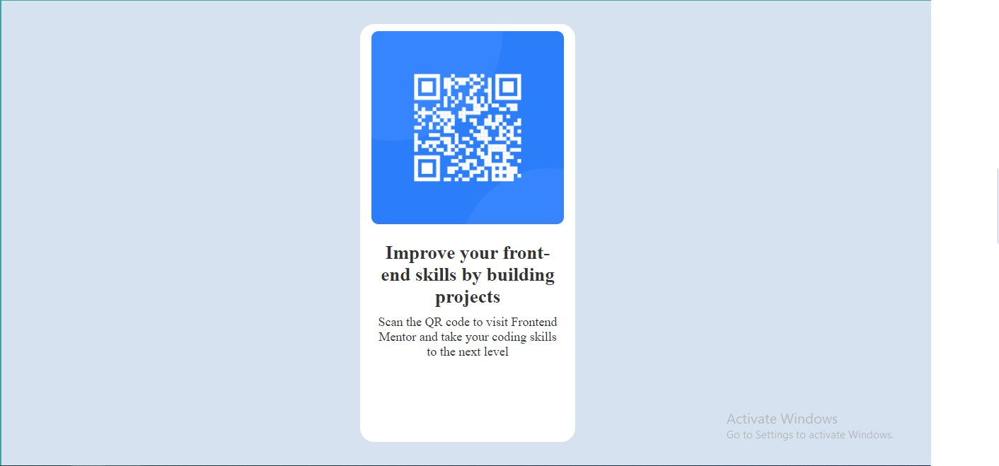

# Frontend Mentor - QR code component solution

This is a solution to the [QR code component challenge on Frontend Mentor](https://www.frontendmentor.io/challenges/qr-code-component-iux_sIO_H). Frontend Mentor challenges help you improve your coding skills by building realistic projects. 

## Table of contents

- [Overview](#overview)
  - [Screenshot](#screenshot)
  - [Links](#links)
- [My process](#my-process)
  - [Built with](#built-with)
  - [What I learned](#what-i-learned)
  - [Continued development](#continued-development)
  - [Useful resources](#useful-resources)
- [Author](#author)
- [Acknowledgments](#acknowledgments)

## Overview
first project in front end mentor
### Screenshot

### Links

- Solution URL: [https://github.com/yahia5034/QRCode](https://github.com/yahia5034/QRCode)
- Live Site URL: [https://yahia5034.github.io/QRCode/](https://yahia5034.github.io/QRCode/)

## My process

### Built with

- Semantic HTML5 markup
- CSS custom properties
- Flexbox
- CSS flex
### What I learned

The image centered and kept in a block
img {
      display: block;
      margin-bottom: 10px;
      margin-left: auto;
      margin-right: auto;
      width: 90%;
      border-radius: 10px;
    }
Really learned how to use the UI/UX design and knowed the structure of html 

### Continued development

I'll focuse in the design and how to style it and see the tree of html components
r own plans for continued development.**

### Useful resources

- [resource 1](https://www.w3schools.com/howto/howto_css_image_center.asp) - This helped me for centering the image and scaling it . I really liked this pattern and will use it going forward.

## Author

- Website - [Yahia mohammed](https://www.your-site.com)
- Frontend Mentor - [@yahia5034](https://www.frontendmentor.io/profile/yahia5034)

## Acknowledgments
A good project to start with to learn basic concepts
